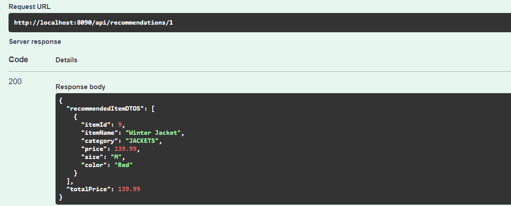

# Wardrobe Recommendation System

### Application Architecture & Technologies Used:
* Backed application is built using Spring Boot 3.3.4 and Java 21.
* MySQL is used as the database
* Flyway is used for database migration.
* Swagger is used for API documentation.
* Docker is used to containerize the application.
* Docker Compose is used to run the application.
* JUnit 5 is used for unit testing.
* Mockito is used for mocking.


### Pre-requisites to run the application with Docker
1. Docker & Docker Compose installed (I used Docker Desktop for Windows)
2. Java 21
3. Maven (I used 3.9.6)
### How to run the backend application with docker?
1. Clone the repository
2. Go to the backend folder or open it in IntelliJ or your favorite IDE
3. Run the following commands

```bash
mvn clean package
```
###### Then run the following command to build the docker image
```bash
docker-compose build
```
###### Then run the following command to start the backend  docker container
```bash
docker-compose up app
```
4. The backend application should be running on port 8090
5. You can check the health of the application by going to the following URL: http://localhost:8090/actuator/health
6. You access the swagger UI by going to the following URL: http://localhost:8080/swagger-ui.html

###### To stop the application, run the following command:
```bash
docker-compose down
```

### flyway migration scripts:
* I used Flyway as the DB migration tool.
* The migration scripts are located in the following folder: `/src/main/resources/db.migration/`
* You will find 4 scripts inside the `migration` folder

### Future Improvements to the API:
* Secure the API with Spring Security. Probably use JWT for authentication and authorization.

### Sample request


### Sample response


### _Thanks for reading this far. I hope you enjoyed it :)_
